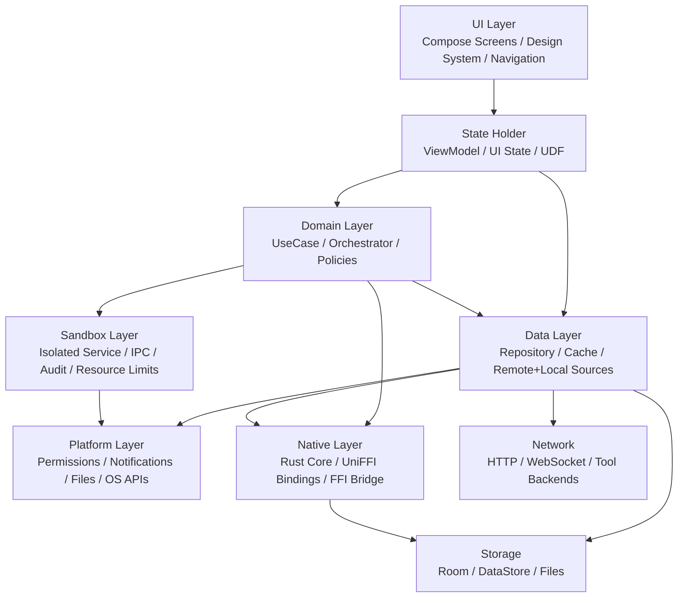

# Android 端 Agent 应用架构深度研究报告

## 执行摘要

本报告面向一款“最新、完整的 Android 手机端 Agent 应用”的工程设计：应用采用 **MVVM + 多模块**，UI 使用 **Jetpack Compose**，核心能力部分由 **Rust + Mozilla UniFFI** 提供，且需要集成多种工具能力，并包含面向工具执行的 **Linux 沙盒运行环境**。基于当前 Android 官方架构建议，推荐采用**分层架构 + 纵向功能模块 + 横向核心基础设施模块**的组织方式：至少保持 **UI 层** 与 **Data 层** 明确分离，按需增加 **Domain/UseCase 层**；UI 层通过状态持有者（通常是 `ViewModel`）驱动 Compose，遵循**单向数据流**与**单一事实来源**；Data 层以 **Repository** 作为唯一入口，不允许 UI 或 UseCase 直接依赖底层 data source。多模块化方面，应避免“按技术栈切得过碎”与“单体 feature 模块过胖”这两种极端，建议使用“**core/platform/native/sandbox 横向模块** + **feature 垂直切片模块**”的混合模式。
  在技术选型上，当前 Android 官方文档建议 Compose-first，且当前稳定的 Compose BOM 为 **2026.06.00**；Activity Compose 已到 **1.13.0**，Lifecycle 到 **2.11.0**，Navigation Compose 到 **2.9.8**，同时 **Navigation 3 1.1.3** 已进入稳定通道，适合强 Compose-first 的新项目评估。数据层建议默认采用 **Room 2.8.4 + DataStore 1.2.1**；后台与可靠任务调度建议用 **WorkManager 2.11.2**；安全与密钥保护建议以 **Android Keystore/Jetpack Security** 为基础；DI 首选 **Dagger/Hilt 2.59.2 + androidx.hilt 1.3.0**。工具链方面，AGP 当前稳定补丁可落到 **9.2.1**，其兼容矩阵对应 **Gradle 9.4.1、JDK 17、默认 NDK 28.2**。Kotlin 官方当前稳定版为 **2.4.0**，但由于 **KSP** 与部分注解处理链经常滞后于 Kotlin 主版本，生产上应把“当前最新稳定”与“当前最稳落地组合”区分开来管理。
对 **Rust + UniFFI**，本报告的结论是：在 Android 上，**Rust 负责“高价值、可复用、性能/安全敏感”的核心引擎**，例如 Agent orchestration core、工具协议适配、规则引擎、会话压缩、计划执行图、沙盒命令规范化等；**Kotlin 负责 Android 生命周期、权限、系统 API、通知、WorkManager、前台服务、UI、导航与本地存储接入**。UniFFI 非常适合将 Rust 逻辑暴露给 Kotlin：它官方支持 Kotlin，支持 async 到 Kotlin `suspend` 的映射，支持 records/enums/errors/custom types/external types，但它**只负责生成绑定，不负责帮你完成平台构建与分发**；同时，Kotlin 侧对 Rust 暴露对象的生命周期回收通常仍应显式 `close()`，不能假设 JVM GC 会自动可靠清理底层 Rust 资源。

对“**Linux 沙盒运行环境**”，本报告给出的核心判断是：**若目标包含 Play Store 合规发布，推荐把“安全执行环境”设计为 Android 应用沙盒内的隔离执行服务，而不是在量产手机上追求完整 Linux 容器栈**。Android 已提供应用沙盒；`isolatedProcess=true` 的 Service 可运行在隔离进程中，且“没有自己的权限”；这是在 stock Android 上最现实、最可审计、最接近 Play 审核预期的本地隔离方案。相反，`chroot` 需要 `CAP_SYS_CHROOT`，完整 namespace/container 方案通常还需要更高的内核能力、cgroups、daemon、overlayfs 等宿主级能力；**gVisor / containerd / 真正 OCI 容器**在普通手机应用进程中基本不具备可操作性，除非是企业专用设备、root、定制 ROM，或干脆不走 Play 分发。更关键的是，Google Play 的 Device & Network Abuse / Malware 规则明确限制应用从 Google Play 之外下载可执行代码（包括 dex/JAR/.so）；只有运行在解释器/虚拟机中、且仅**间接**访问 Android API 的代码存在政策例外。因此，若必须上架 Play，推荐的本地“沙盒”应优先选择 **isolated process + Binder IPC + 文件/能力白名单 + 资源限额 + 审计日志** 的 Android-native 方案；若业务真需要“完整 Linux 用户态 + 动态安装包 + ELF 执行”，则更适合私有分发、企业分发或远端执行。

## 假设与设计原则

### 未指定项与建议

你已明确说明以下事项均为**未指定**：**最低 SDK、目标 API 级别、支持 CPU 架构、是否上 Play Store、是否需要离线模型推理、是否需要端侧 ML 加速**。本报告保留这些状态，并给出工程上更稳妥的默认建议。citeturn36search17turn36search7turn25search2

建议把“当前最新稳定版本”与“当前生产锁定版本”分开管理。原因很现实：Android 生态中的 **AGP / Kotlin / KSP / Hilt / Room / Compose Compiler** 并不总是同步发布；即使单个组件“最新稳定”，也不意味着整个组合是**最快稳态**。例如 AGP 9.2.1 已稳定，Kotlin 2.4.0 已是官方当前稳定版，但 KSP 的版本线与 Kotlin 主版本常常需要单独校验；因此应在版本目录中同时维护 `latestStable` 与 `prodLocked` 两组锚点。

### 推荐的默认约束

如果没有进一步业务约束，建议把 **minSdk 默认建议值设为 26**，**targetSdk/compileSdk 跟随当前发布平台**，并以 **arm64-v8a** 作为生产必选 ABI；`armeabi-v7a` 仅在明确存在 32 位用户群时再保留，`x86_64` 主要用于模拟器与 CI 测试。这样做的原因是：现代 Jetpack 组件已经越来越偏向较新的 API 基线，例如 WorkManager 2.11 已把 `minSdk` 提升到 23，Room 2.8 也提升到了 23；而 Android NDK 与 Rust 官方 Android targets 对 `aarch64-linux-android` 支持最好，移动端真实用户也早已以 64 位 ARM 为主。这里的 `minSdk 26` 属于架构建议，而不是官方硬性要求；若你追求更广覆盖，也可以退到 23，但要为后台限制、权限分流、文件访问差异付出额外复杂度。

如果**计划上架 Google Play**，应一开始就按 **Android App Bundle + Play App Signing + 动态功能模块按需交付** 的发布模型设计，且沙盒/工具插件能力不能依赖“从自家服务器下载可执行代码”这一路径；如果**不走 Play、而走企业或私有分发**，则可以适度放宽对本地 Linux 用户态与工具包分发的设计约束，但仍建议保留签名、版本回滚保护、原生符号管理与审计日志。

## 推荐项目结构与模块边界

### 推荐的目录树

下面给出一个适合此类 Agent 应用的**推荐多模块目录树**。它采用“**根工程基础设施** + **core 横向基础模块** + **platform/os 适配层** + **feature 垂直能力切片** + **native/rust** + **sandbox 隔离执行** + **质量与发布模块**”的结构。这样的组织方式与 Android 官方“推荐分层 + 多模块化”思路一致，同时便于 Rust 组件、沙盒组件和 Feature Delivery 并行演进。

```text
root
├── app
│   ├── src
│   └── build.gradle.kts
├── build-logic
│   ├── convention
│   ├── quality
│   └── publishing
├── gradle
│   ├── libs.versions.toml
│   └── wrapper
├── core
│   ├── common
│   ├── model
│   ├── coroutine
│   ├── ui
│   ├── designsystem
│   ├── navigation
│   ├── security
│   ├── network
│   ├── database
│   ├── datastore
│   └── testing
├── platform
│   ├── os
│   ├── permissions
│   ├── notifications
│   ├── files
│   └── telemetry
├── feature
│   ├── home
│   │   ├── api
│   │   └── impl
│   ├── session
│   │   ├── api
│   │   └── impl
│   ├── chat
│   │   ├── api
│   │   └── impl
│   ├── tools
│   │   ├── api
│   │   └── impl
│   ├── settings
│   │   ├── api
│   │   └── impl
│   └── diagnostics
│       ├── api
│       └── impl
├── data
│   ├── agent
│   ├── toolcatalog
│   ├── memory
│   ├── sessionstore
│   └── sync
├── native
│   ├── bridge
│   ├── generated-bindings
│   └── packaging
├── rust
│   ├── Cargo.toml
│   ├── crates
│   │   ├── agent_core
│   │   ├── tool_runtime
│   │   ├── planner
│   │   ├── sandbox_protocol
│   │   └── ffi_entry
│   └── scripts
├── sandbox
│   ├── api
│   ├── service
│   ├── protocol
│   └── policy
├── baselineprofile
├── benchmark
├── docs
└── ci
```

### 模块目录表

| 模块 | 类型 | 主要职责 | 允许依赖 | 边界约束 |
|---|---|---|---|---|
| `:app` | 应用装配层 | Application、主 Activity、依赖装配入口、导航宿主、动态功能声明 | `feature:*:api`、`core:navigation`、`platform:*`、`sandbox:api` | 不直接依赖 `data:*` 实现，不直接调用 Rust FFI |
| `:core:common` | 基础库 | Result/Either、错误码、时间、ID、日志接口、常量 | 无或仅 Kotlin stdlib | 不含 Android UI 依赖 |
| `:core:model` | 共享模型 | DTO、UI 只读模型、领域枚举、能力描述 | `core:common` | 不放 Repository、ViewModel |
| `:core:ui` | UI 公共层 | 通用 Compose 组件、状态封装、状态恢复辅助 | `core:model`、Compose | 不放业务 ViewModel |
| `:core:designsystem` | 设计系统 | Theme、Typography、Color、Icon、Spacing、Adaptive 基础能力 | Compose、Material3 | 不引入 feature 业务语义 |
| `:core:navigation` | 导航契约层 | 路由定义、导航事件、feature entry 接口 | `core:common` | 不持有页面实现 |
| `:core:security` | 安全基础层 | Keystore 封装、加密策略、签名/完整性校验接口 | `platform:os`、Jetpack Security | 不直接暴露底层 keystore API 到业务层 |
| `:core:network` | 网络基础层 | HTTP client、序列化、认证、拦截器、重试、超时策略 | Retrofit/Ktor、`core:common` | 不含业务 API 定义 |
| `:core:database` | 本地结构化存储 | Room/driver、migration、DAO 基础设施 | `core:model` | 不放 feature 业务逻辑 |
| `:core:datastore` | 偏好与轻量配置 | DataStore、用户设置、feature flags | `core:common` | 不负责复杂查询 |
| `:platform:*` | OS 适配层 | 权限、通知、文件 URI、前台服务、系统能力、Telemetry SDK 封装 | Android framework | 只向上暴露接口/门面，不向 UI 泄漏平台细节 |
| `:feature:*:api` | Feature 契约层 | 导航入口、公开 UseCase/Facade、页面公开参数 | `core:*` | 禁止依赖 `impl` |
| `:feature:*:impl` | Feature 实现层 | Compose Screen、ViewModel、UseCase 编排 | `feature:*:api`、`data:*`、`platform:*` | 不被其他 feature 的 `impl` 直接依赖 |
| `:data:*` | 数据层实现 | Repository、remote/local data source、缓存一致性、映射 | `core:network`、`core:database`、`core:datastore`、`native:bridge` | 只能通过 Repository 暴露能力，不能让 UI 直接访问 data source |
| `:native:bridge` | Kotlin ↔ Rust 边界层 | 加载 `.so`、UniFFI 绑定适配、异常映射、线程/dispatcher 适配 | `native:generated-bindings`、`core:common` | 只暴露 Kotlin 友好 API，不向上泄漏 FFI 细节 |
| `:native:generated-bindings` | 生成代码层 | UniFFI 生成的 Kotlin 绑定 | `native` runtime | 建议 build/generated 管理，避免手改 |
| `:rust:crates:*` | 原生核心层 | Agent core、planner、tool runtime、protocol、FFI entry | Rust crates | 不依赖 Android API |
| `:sandbox:api` | 沙盒契约层 | Binder/IPC facade、请求响应模型、能力白名单 | `core:model` | 不含执行实现 |
| `:sandbox:service` | 隔离执行层 | isolated process Service、命令调度、资源限制、审计 | `sandbox:api`、`platform:os` | 不暴露给 UI 直接调用底层进程对象 |
| `:sandbox:protocol` | 执行协议层 | JSON/Proto schema、序列化边界、versioned protocol | `core:common`、`rust` 协议 crate | 版本必须可演进 |
| `:baselineprofile` / `:benchmark` | 质量层 | 启动性能、关键路径优化、基准测试 | `app`、Macrobenchmark/ProfileInstaller | 不参与生产业务逻辑 |

上述划分遵循两个关键边界：其一，**所有数据访问必须经 Repository**；其二，**feature 之间只通过 `api` 对接，不互相依赖 `impl`**。这与 Android 官方将 Repository 作为 data layer 入口、以及多模块工程鼓励使用清晰模块边界的建议一致。

## 分层架构与运行时流程

### 推荐的分层架构图



### 各层职责说明

这张图对应 Android 官方推荐的典型架构：**UI 层**负责展示与事件采集，**Data 层**负责应用数据与业务逻辑，**Domain 层**是可选的中间层，用于封装复杂或可复用业务规则。对你的 Agent 场景而言，Domain 层并不只是“可选”，而是**强烈建议存在**，因为 Agent orchestration、工具路由、计划分解、上下文裁剪、重试策略、权限策略、执行预算等逻辑，既复杂，又往往跨多个 ViewModel 复用。

**UI 层（Compose）**只关心渲染当前 `UiState` 和发送用户事件，不直接访问 data source，也不直接处理底层 OS 或 FFI 细节。Compose 是 Android 官方推荐的 UI 工具包；UI 层应使用 UDF，把事件交给状态持有者，由 ViewModel 产出 `StateFlow`/`SnapshotState` 等可观察状态。这样既利于预览和测试，也便于以后拆出动态功能模块。

**ViewModel / State Holder 层**负责状态生产管线：接收 UI 事件，触发 UseCase 或 Repository，折叠为稳定的 `UiState`。官方指导明确区分“事件”与“状态”，并强调状态生产应遵循单向数据流。你的 Agent 应用建议把“用户输入事件、系统回调事件、工具执行事件、模型流式输出事件、沙盒回传事件”统一抽象为 state reducer 的输入，从而避免“Compose 页面直接拼业务流程”的失控写法。

**Domain/UseCase 层**建议至少包含：会话发送用例、工具发现用例、工具调用仲裁用例、Agent 计划执行用例、上下文压缩用例、沙盒会话管理用例、权限/能力策略用例。Android 官方指出，Domain 层适合承载复杂逻辑、复用逻辑与提升测试性；你的场景正符合这个条件。UseCase 应尽量细粒度、单职责、无内部可变状态。

**Data/Repository 层**负责汇聚网络、本地数据库、偏好存储、文件系统与原生引擎结果。Repository 是唯一入口，负责冲突解决、缓存一致性和源抽象；无论是聊天历史、工具目录、执行会话、用户配置还是模型/工具后端连接信息，都应通过 Repository 暴露，而不是让 ViewModel 直接拿 DAO、HTTP service 或 JNI/FFI 句柄。

**Native 层（Rust/UniFFI）**的职责应限定为：高强度状态机、协议处理、执行图/计划器、内容解析、压缩/加密、工具协议统一、WASM/脚本运行时封装、以及与沙盒协议共享的纯业务逻辑。不要把 Android `Context`、权限请求、通知渠道、URI 权限、一切生命周期相关逻辑塞进 Rust；这些应由 Kotlin 的 Platform/OS 层来完成，然后通过接口或 callback/foreign trait 回传给 Rust。UniFFI 正适合这种“Rust 核心 + Kotlin 平台壳”的边界划分。

**Sandbox/容器层**不建议成为 UI 或 Feature 的直接依赖。正确方式是：Feature 触发 Domain 用例，Domain 使用 `SandboxFacade` 发起执行请求，`sandbox:service` 在隔离进程中执行、记录审计、限制资源，并把结构化结果经 IPC 返回。这样才能避免“页面直接持有进程/服务句柄”，也更符合后续替换执行后端的需要。

## 核心技术组件与版本建议

### 版本表

下表把“**当前已查证的稳定版本**”与“**生产落地建议**”分开写，目的是降低升级链断裂的风险。对大多数 Android 项目而言，真正要追求的是“**整套组合稳定**”，而不是“每个组件都取到自己最新”。

| 组件 | 当前已查证稳定版本 | 生产落地建议 | 替代选项 | 说明 |
|---|---:|---|---|---|
| JDK | 17 | 17 | 21 仅在工具链完全验证后使用 | AGP 9.2 兼容矩阵要求/默认 JDK 17。 |
| Android Gradle Plugin | 9.2.1 | 9.2.1 | 9.1.1 保守回退 | 9.2.0 页面已列出 9.2.1 修复；Android Studio 同步发布 9.2.1。 |
| Gradle | 9.4.1 | 9.4.1 | 按 AGP 兼容矩阵下调 | AGP 9.2 默认/最低为 9.4.1。 |
| Kotlin | 2.4.0 | 若 KSP 链未就绪，可先锁 2.3.21 分支 | 2.3.21 | Kotlin 官方当前稳定版为 2.4.0；但 Compose 编译插件与 KSP 要跟矩阵走。 |
| Compose Compiler Gradle Plugin | 与 Kotlin 同版 | 与 Kotlin 精确对齐 | — | 官方文档明确该插件版本与 Kotlin 版本匹配。 |
| Compose BOM | 2026.06.00 | 2026.06.00 | 2026.04.01 | 官方文档要求“始终使用最新 BOM”；当前文档示例为 2026.06.00。 |
| Compose Core | BOM 对应 1.11.x 稳定线 | 跟随 BOM | 直接手工锁定子库版本 | 2026.04 稳定版引入 Compose 1.11；稳定通道已到 1.11.3。 |
| Activity Compose | 1.13.0 | 1.13.0 | — | 官方稳定版。 |
| Lifecycle | 2.11.0 | 2.11.0 | — | 官方稳定版，含 Compose scoped ViewModelStore 改进。 |
| Navigation Compose | 2.9.8 | 2.9.8 | Navigation 3 1.1.3 | 2.9.8 是成熟默认；Navigation 3 已稳定，建议 greenfield 评估。 |
| Coroutines / Flow | 1.11.0 | 1.11.0，但需做 Kotlin 版本兼容验收 | — | 当前最新稳定为 1.11.0。 |
| Dagger / Hilt | 2.59.2 | 2.59.2 | Koin | 2.59 增加 AGP 9 支持，2.59.2 为最新稳定补丁。 |
| `androidx.hilt` | 1.3.0 | 1.3.0 | 手写 ViewModelFactory | Compose 的 `hiltViewModel()` 已迁到 `hilt-lifecycle-viewmodel-compose`。 |
| KSP | 2.3.5 | 必须与 Kotlin 分支精确匹配；升级前单独验收 | kapt | 已查证稳定版至少到 2.3.5；KSP 文档主线已出现更高版本占位，说明版本节奏独立。 |
| Room | 2.8.4 | 2.8.4 | SQLDelight 2.3.2 | 结构化本地存储默认首选，Repository + DAO 生态最成熟。 |
| DataStore | 1.2.1 | 1.2.1 | MMKV / EncryptedSharedPreferences | 轻量配置、偏好与 flags 首选。 |
| WorkManager | 2.11.2 | 2.11.2 | Foreground Service 仅限用户可见长任务 | 可靠后台任务首选；2.11 以后 `minSdk` 为 23。 |
| Security Crypto | 1.1.0 | 1.1.0 | 直接用 Android Keystore | 适合加密文件/偏好与密钥管理门面。 |
| AndroidX Test Runner / Rules | 1.7.0 | 1.7.0 | — | 仪器化测试基础设施。citeturn12search6 |
| Benchmark / Macrobenchmark | 1.4.1 | 1.4.1 | 仅自建 trace 脚本 | 1.4.1 是更合理的现行稳定线；1.5.x 仍是 alpha。citeturn43search2 |
| ProfileInstaller | 1.4.1 | 1.4.1 | — | Baseline Profile 落地的稳定搭档。citeturn40search6 |
| Retrofit | 3.0.0 | 3.0.0 | Ktor Client 3.5.0 | 生态成熟、上手成本低，适合传统 REST。citeturn14search0turn14search4 |
| Ktor Client | 3.5.0 | 3.5.0 | Retrofit | 更适合统一多平台网络栈或更活跃自定义管线。citeturn14search1turn14search21 |
| SQLDelight | 2.3.2 | 2.3.2 | Room | 若未来考虑更强跨平台数据库共享，可替代 Room。citeturn14search3 |
| Rust toolchain | 1.96.0 | 跟稳定版；UniFFI 升级前先做 ABI 回归 | 旧稳定版冻结 | Rust 官方最新稳定发布。citeturn31search0turn31search5 |
| UniFFI | 0.31.2 | 0.31.2，且绑定生成应纳入 CI | `jni-rs` 手写绑定 | 官方 Kotlin 支持成熟，但仍是 0.x 线，需控制升级节奏。citeturn33search1turn30search2turn30search9 |

### 默认推荐与替代关系

如果你的目标是**Android-only、团队以 Android 工程师为主、优先降低复杂度**，推荐的默认组合是：**Kotlin + Compose BOM + Lifecycle + Navigation Compose + Hilt + Room + DataStore + WorkManager + Retrofit + Rust/UniFFI**。这条组合的优点是生态成熟、招人容易、排障资料多、与官方架构指导一致。citeturn44search6turn44search2turn40search8turn17search1turn39search0turn14search4

如果你明确希望把 **网络层、本地存储层或业务规则进一步跨端复用**，则可把默认的 Retrofit/Room 替换成 **Ktor Client / SQLDelight**；但在 Android-only 项目里，这样做的好处未必能抵消复杂度上升。尤其当你已经引入 Rust 作为跨语言核心时，再额外追求 Kotlin 多平台的网络/数据库共享，往往会让系统在“共享层”上出现重复投资。citeturn14search1turn14search3turn33search1

对于 **Accompanist**，本报告不建议它进入“基础必选栈”。官方 Compose 与 AndroidX 已逐步覆盖许多曾依赖 Accompanist 的能力；因此更稳妥的做法是：**默认不引入，确有缺口时再单点引入**，并把它视为“项目级可选依赖”而非全局基础设施。该结论属于架构建议，不是基于单一官方版本表的硬要求。citeturn44search2turn11view0

## Rust 与 UniFFI 集成方案

### 推荐集成方式

建议将 Rust 工程独立为根目录下的 `rust/` workspace，并通过 `:native:bridge` 与 Android Gradle 工程衔接。Rust 侧至少拆成三个层次：**纯业务 crate**、**协议/类型 crate**、**FFI 入口 crate**。只有最外层 `ffi_entry` 或等效 crate 暴露 UniFFI 接口并编译为 `cdylib`；内部业务 crate 不应感知 Android 平台，也不应夹带 JNI 细节。UniFFI 官方说明非常清楚：它会生成 Kotlin 绑定，但**不会替你完成平台构建与打包**，所以 Gradle/CI 必须把“构建 `.so` → 生成绑定 → 打进 Android 模块”串起来。citeturn33search5turn33search11turn33search1

在接口设计上，UniFFI 支持直接从 Rust proc-macro 或 UDL 生成绑定。若团队未来希望接口演进更可审查、生成更稳定、协议文档更清晰，建议 **对外 FFI 面保留独立 UDL 或至少保证 Rust 导出层极薄**；若团队更偏爱“源码即接口”，则 proc-macro 方式也可行。无论哪种方式，都要把**Kotlin 绑定文件视为生成物，而不是手写源码**。citeturn34search5turn33search11turn33search5

### ABI、多架构与打包建议

Rust 官方 Android target 文档列出了 `aarch64-linux-android`、`armv7-linux-androideabi`、`x86_64-linux-android` 等目标；建议生产默认至少输出 **arm64-v8a**，必要时再补 `armeabi-v7a`，并始终在 CI 中构建 `x86_64` 以支持模拟器与自动化测试。Android NDK 的 ABI 文档也表明这些是标准支持的 ABI 集合。citeturn32search0turn36search7

打包策略上，建议 **AAB 主线 + 每 ABI 独立 native library**。如果走 Google Play，AAB 会把代码与资源按模块组织，由 Google Play 按设备生成最终 APK 集合；如果走私有渠道，也可按需生成 ABI splits APK，但维护成本更高。对含 Rust 的应用而言，AAB 往往更省心，因为无需自己维护多 APK 的 `versionCode` 偏移规则。citeturn36search4turn36search15turn36search11

### 类型映射、错误处理与资源管理

UniFFI 的底层模型是“**lowering / lifting**”：Rust 与 Kotlin 之间通过 C 风格 FFI 交换基础表示，再分别提升/降级为各自语言的高阶类型。因此，建议接口层优先使用 **primitives、String、bytes、records、enums、maps、lists、domain errors**，而把复杂平台对象如 `Uri`、`ParcelFileDescriptor`、`Context`、`Notification` 等留在 Kotlin/Platform 层，通过 ID、句柄或自定义类型进行桥接。对于确实需要跨边界的特殊类型，UniFFI 提供 custom types 与 external types 机制。citeturn33search12turn34search4turn33search7

错误处理建议采用**“领域错误枚举 + 结构化错误码 + Kotlin 侧异常门面”**。UniFFI 会把 `Result<T, E>` 中的 `Err` 映射成 Kotlin/Swift 等语言中的异常；因此 Rust 侧应该避免把所有错误都塞进字符串，而是为可预期失败定义稳定的 error enum/interface。若未来需要把某些错误字段直接暴露给 Kotlin 层做 UI 判定，也应使用带字段的 UniFFI error 定义。citeturn34search0turn34search1

资源管理上，必须把“**Rust 对象生命周期**”当成一等设计问题。UniFFI 的 Kotlin 生命周期文档明确指出，Kotlin 暴露对象通常应显式 `close()` 来回收 Rust 资源；其设计原则页也提到 JVM/GC 集成并非完全透明。因此，不要把长生命周期原生对象直接绑进可反复重组的 Composable；推荐由 ViewModel 或 Repository 持有，并在 `onCleared()`、`close()` 或作用域结束时显式释放。citeturn33search14turn33search6

### JNI/NDK 调试建议

虽然你准备用 UniFFI 而不是手写 JNI，但调试层面仍然要按 Android 原生代码最佳实践执行。Android 官方 JNI tips 文档强调 JNI 边界在引用管理、线程附着、异常传播、GC 兼容性方面容易出问题；Android 也提供 LLDB、ndk-gdb、native crash 调试和 native memory 调试工具。实践上，建议至少建立四类基线能力：**崩溃符号化、FFI 边界结构化日志、内存泄漏排查、跨语言异常映射测试**。citeturn35search0turn35search4turn35search16turn35search18turn35search14

## Linux 沙盒方案评估

### 结论先行

若背景是**普通 Android 手机、无 root、可能需要 Play Store 发布**，则推荐的本地执行方案不是“真正 Linux 容器”，而是 **Android Application Sandbox + `isolatedProcess` Service + Binder IPC + 文件/权限/CPU/内存/时长配额控制**。Android 本身就基于 Linux 用户隔离应用；而 `isolatedProcess=true` 的 Service 会运行在一个“隔离于系统其他部分、且没有自身权限”的特殊进程里。对你要做的 Agent 工具执行而言，这是最现实、最可审计、最容易解释给安全评审与 Play 审核的选择。citeturn21search1turn22view0turn21search20

如果你的真实需求不是“运行完整 Linux 用户态程序”，而是“给 Agent 一个安全的本地工具执行上下文”，那就更没有必要执着于 `chroot/containerd/gVisor`。更好的做法是：**把工具能力分类**。轻量、文本型、可约束的工具尽量做成 Kotlin/Rust 内建工具；脚本型能力优先放进解释器或 VM（注意 Play 对解释器/VM 有政策例外，但它们只能间接访问 Android API）；只有确实需要系统进程语义的能力，才放入隔离执行服务，并对输入输出做严格模式化。citeturn25search2turn25search9turn21search3

### 各方案对比

| 方案 | 安全性 | 可行性 | 性能 | Play Store 合规性 | 结论 |
|---|---|---|---|---|---|
| Android 应用沙盒 + `isolatedProcess` Service | 高 | 高 | 中高 | 高 | **首选**。基于官方机制，适合本地工具执行。citeturn21search1turn22view0 |
| `chroot` / 类 chroot rootfs | 中 | 低 | 中 | 低 | `chroot()` 需要 `CAP_SYS_CHROOT`；普通应用基本不可行。citeturn26search0turn26search3 |
| user namespaces + rootless 容器思路 | 中高 | 低到不确定 | 中 | 低到不确定 | Linux 支持 user namespace，但其他 namespace / mount 常需更高能力；在 Android 量产机上高度不确定。此结论为基于内核能力文档与 Android 沙盒约束的工程推断。citeturn26search1turn26search18turn26search11turn21search1 |
| gVisor | 高 | 很低 | 中 | 低 | gVisor 面向容器宿主场景，依赖既有容器运行基础；在普通手机应用中不现实。该结论为基于 gVisor 定位与 Android 环境差异的工程推断。citeturn23search5turn23search1turn24search1 |
| containerd / OCI 容器 | 高 | 很低 | 中 | 很低 | containerd 是宿主级 daemon，依赖 cgroups、snapshotter、宿主运行时能力；普通 App 不适合作为容器宿主。citeturn24search1turn24search2turn24search0 |
| Termux / proot / 类用户态 Linux 环境 | 低到中 | 中 | 低到中 | 低 | 技术上能实现一部分 Linux 用户态体验，但隔离弱、审计难、执行下载代码的政策风险高，不适合作为标准 Play 方案。该合规判断主要依据 Play 对可执行代码下载与恶意行为的限制。citeturn25search2turn25search9turn21search3 |

### 推荐落地方案

推荐采用 **“Sandboxed Execution Service”** 架构：  
应用主进程只负责发起**结构化执行请求**；隔离进程中的 `sandbox:service` 根据白名单决定是否允许执行；每个执行会话拥有独立工作目录、资源配额、超时与审计日志；沙盒不直接暴露 Android 权限，而是通过受控的 Binder capability 请求 Platform 层代办有限操作，例如“读取用户显式授权的 URI”、“写入应用专属缓存目录”、“触发一次通知”。这种设计能最大限度利用 Android 现成沙盒，而不把自己带进“自建容器平台”的复杂度沼泽。citeturn21search1turn22view0turn44search3

如果业务将来明确要求“**完整 Linux 用户态工具链、本地 ELF 执行、工具包动态安装**”，那应尽早在产品层做二选一：  
要么**放弃 Play Store 主分发**，转企业/私有渠道；  
要么把这类执行迁到**远端 Linux 沙盒**，手机端仅保留任务编排与受限本地工具。  
这是因为 Google Play 对应用自更新、下载 dex/JAR/.so 等可执行代码有明确限制；只有运行在解释器/虚拟机中的代码具备窄范围例外。citeturn25search2turn25search9turn21search2

## CI/CD、非功能要求与里程碑

### CI/CD 与构建发布建议

建议把 CI/CD 分成四条主线：**Android lint/test 线、Rust build/test 线、多 ABI 打包线、发布与符号上传线**。Android 侧输出 AAB 为主；Rust 侧针对目标 ABI 输出 `.so`；然后在集成阶段完成 UniFFI 绑定生成、native library 装包、基线性能检查、签名与发布。Google Play 推荐使用 Play App Signing；新应用上传 AAB 时，Play 会托管正式签名并生成针对设备的 APK 组合。citeturn36search15turn36search1turn35search14

版本策略建议使用“三段式”：**用户可见版本号 `versionName`**、**单调递增内部版本 `versionCode`**、**原生协议/沙盒协议版本号**。`versionCode` 必须递增，Play Console 还设有上限；协议号则独立于 App 版本，以支持 Rust FFI、沙盒协议和持久化 schema 的灰度兼容。对于多 ABI 或 Feature Delivery，不要再维护 APK 维度的 `versionCode` 偏移，统一交给 AAB 体系。citeturn36search2turn36search11turn36search16turn36search8

发布阶段务必管理**native symbols**。Android 官方说明可以为 Google Play 上传 native debug symbols，这样 Android vitals 才能把 native crash 正确符号化。对你的项目，这一点尤其关键，因为一旦 Rust/FFI 出现 OOM、SIGSEGV、use-after-free 或 ABI 不匹配，是否有符号文件会直接决定线上可维护性。citeturn35search14turn35search4

### 关键非功能需求考量

| 关注点 | 建议 |
|---|---|
| 安全 | 默认最小权限；密钥存 Android Keystore；敏感会话和 token 经 `core:security` 统一封装；沙盒进程零权限、能力白名单、执行审计。citeturn35search17turn21search1turn22view0 |
| 隐私 | 把工具调用、文件访问、外部网络访问做成用户可见的“能力授权”；上 Play 时同步核对 Data safety 与敏感权限声明。citeturn21search13turn25search7 |
| 性能 | 首屏路径做 Baseline Profile；关键会话列表、聊天滚动、工具执行详情页做 Macrobenchmark；对 Rust/FFI 路径单独做冷启动与热路径采样。citeturn38search0turn38search3turn43search2 |
| 内存 | Rust 对象显式 `close()`；长生命周期 native handle 不进入 Composable；统一 tombstone 与 OOM 采集。citeturn33search14turn35search18 |
| 启动时间 | App 壳层尽量薄；非关键工具目录延迟初始化；不要在 `Application` 中加载全部 Rust 子系统。citeturn38search0turn38search3 |
| 动态特性 | 可将“诊断、开发者工具、重型可选功能”拆成 dynamic feature；核心会话与安全能力留在 base module。citeturn37search0turn37search2turn37search6 |
| 热更新 | 若指业务资源更新，可做远端配置与规则分发；若指可执行代码热更新，上 Play 不应走自下载 dex/JAR/.so。citeturn25search2turn25search9 |
| 测试策略 | 分层测试：UseCase 单测、Repository 契约测、Compose UI 测、Sandbox IPC 集成测、Rust crate 单测/属性测试/FFI 回归测。citeturn44search0turn12search6turn35search0 |

### 关键决策与权衡点清单

| 决策 | 推荐选择 | 主要收益 | 主要代价 |
|---|---|---|---|
| UI 技术栈 | Compose-first | 官方推荐、状态建模清晰、模块化友好 | 旧 View 系统组件复用成本 |
| 架构核心 | MVVM + 可选但实际建议启用 Domain 层 | 复杂 Agent 逻辑可复用、可测试 | 模块与抽象层数量上升 |
| 模块化 | 横向 core/platform/native + 纵向 feature 切片 | 可扩展、并行开发、边界清晰 | 初期脚手架成本 |
| 原生集成 | Rust + UniFFI | 性能、安全、跨端复用、少手写 JNI | 构建链更复杂，调试门槛更高 |
| 本地存储 | Room + DataStore | 官方生态稳、Android 经验丰富 | 若追求多平台共享，SQLDelight 更自然 |
| 网络层 | Retrofit 默认，Ktor 可替代 | Retrofit 学习成本更低 | Ktor 在跨端场景更优 |
| 沙盒方案 | isolated process 服务化隔离 | Stock Android 可落地、合规性最好 | 不是完整 Linux 容器 |
| 发布渠道 | AAB + Play App Signing | 官方推荐、分发成本低 | 受 Play 动态代码策略约束 |
| 动态能力 | Dynamic Feature 用于可选大模块 | 减小 base 体积，按需安装 | 调试与依赖图更复杂 |

### 优先实施里程碑建议

| 里程碑 | 估算 | 目标产出 | 验收标准 |
|---|---:|---|---|
| 项目基座与版本冻结 | 1.5–2 人周 | 根工程、版本目录、build-logic、lint/test 基线、多模块空壳 | `app` 可编译运行；CI 可完成 assemble、unit test、lint；版本锁定表落库 |
| Compose 壳层与导航骨架 | 1–1.5 人周 | `app`、`core:ui`、`core:designsystem`、`core:navigation`、基础页面容器 | 首页/设置/会话占位页完成导航；UI 状态与事件链闭环 |
| 数据层与本地持久化 | 2–3 人周 | Room/DataStore、Repository 基础设施、会话/配置/工具目录模型 | Repository 单测通过；数据库迁移与偏好读写稳定；无 UI 直连 data source |
| Rust Core + UniFFI MVP | 2–3 人周 | Rust workspace、FFI entry、绑定生成、Kotlin bridge | 至少一条 UseCase 经 Rust 执行成功；多 ABI 构建通过；异常/close 语义测试通过 |
| Agent Orchestration 与工具框架 | 3–4 人周 | Domain 层、工具注册/仲裁/执行链、会话状态机 | “输入 → 计划 → 工具选择 → 输出整合”链路跑通；失败重试和取消可用 |
| Sandbox MVP | 3–4 人周 | `isolatedProcess` 服务、IPC、审计日志、资源/时长限制 | 隔离进程执行至少一类工具；请求/响应结构化；超时/取消/日志可观测 |
| 性能与稳定性 | 2–3 人周 | Baseline Profiles、Macrobenchmark、native symbols、崩溃回归 | 冷启动与关键路径有基准数据；线上符号化可用；P0 崩溃收敛 |
| 发布准备 | 1–2 人周 | AAB、签名、版本策略、动态模块与商店检查 | 内部测试轨道可发布；Play/私有分发 checklist 通过 |

### 开放问题与限制

本报告保留了你明确标注为**未指定**的事项，因此以下建议仍需在立项时最终拍板：  
**最低 SDK / targetSdk / compileSdk 基线、是否必须上架 Play、是否要求完整本地 Linux 用户态、是否需要离线模型推理、是否需要端侧 NPU/GPU 加速、是否必须支持 32 位 ABI。** 这些约束一旦确定，会改变模块切分、沙盒策略、依赖版本冻结与发布路径。

本报告的主要参考来源以官方或权威资源为主，包括 Android Developers 的架构与发布文档、source.android.com 的安全沙盒文档、Mozilla UniFFI 用户指南、Rust 官方发布与 target 支持文档，以及 Google Play 政策文档。
